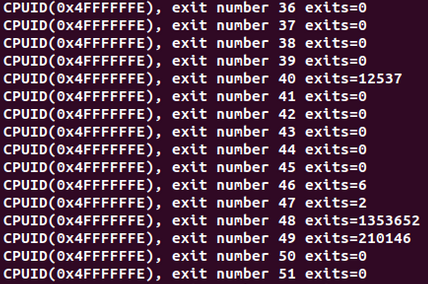
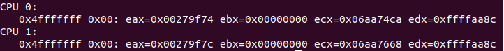
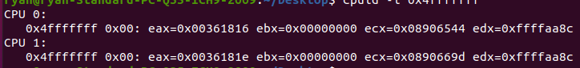
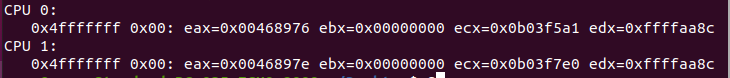

# Assignment 3
# Steps:
1. Downloaded a stable version of linux.
2. In the linux file, used the cp /boot/config/linux-5.11.14 ./.config command, followed by make old config.
3. Ran make modules && make && sudo make install && sudo make install_modules for initial setup and after code changes.
4. Configured the cpuid.c code in the kvm_emulate_cpuid function and vmx_handle_exit function in vmx.c
5. Installed virt-manager and ran a vm with cpuid installed
6. created a user test program to test the output.

# Answer to questions:
Q. How many exits per boot, stable?
A. About 1 million exits per reboot, pretty stable accross each reboot

Initial:

After 1 reboot:

After 2 reboots:

Q. Most frequent types of exits?
A. Top 3 most frequent exits are external interrupt, cpuid and HLT

Q. Least frequent types of exits?
A. There was a lot of exit types that did not have a single exit at all. ie.(MWAIT, Triple Fault, Task Switch etc.)
