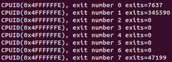
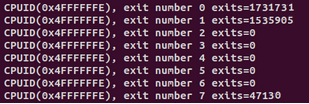

# Assignment 4
# Sample output

ept = 1

ept = 0

# questions
Q: What i have learned from the number of exits

A: The exits were way more when shadow paging was in play, which ws expected, but i did not think it would be as much at it was. Not all exits have increased, only those exits that shadow paging uses such as page fault exiting, cr3 exiting, external interrupts has increased while others such as rdrand exiting wasn't affected as much.

Q: What changed between the runs

A: The amount of exits for certain exit types mentioned above
